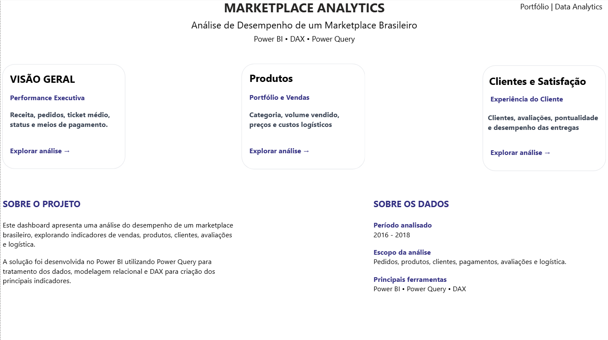
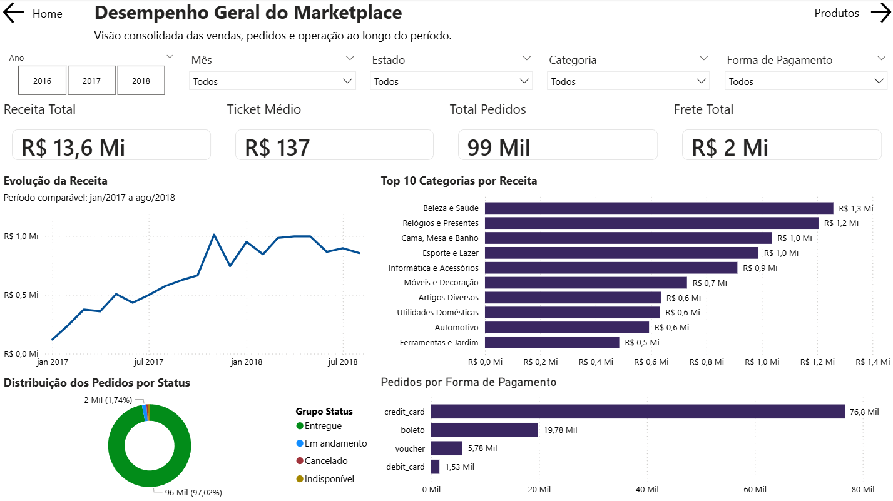
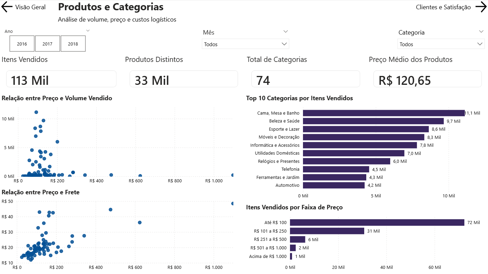
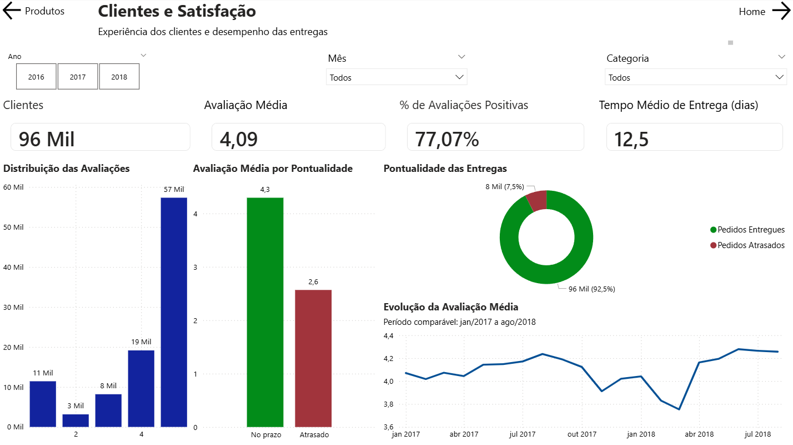
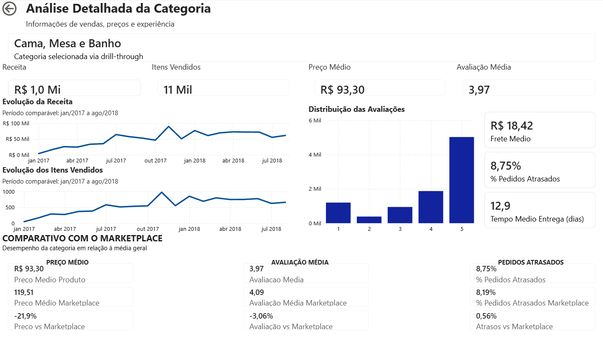
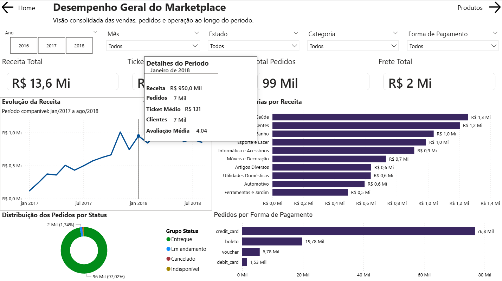
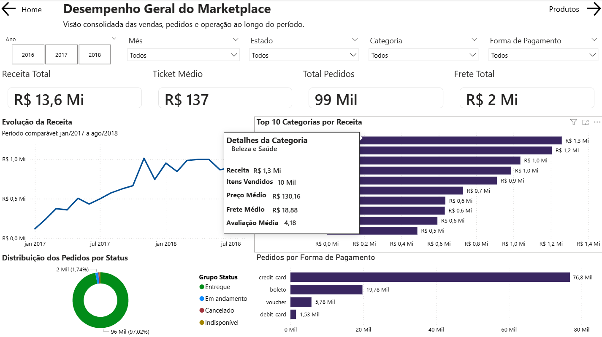
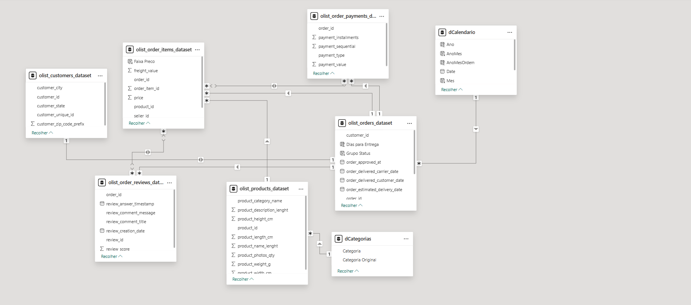

# 📊 Marketplace Analytics — Power BI

🇧🇷 **Português** | [🇺🇸 English](README_EN.md)


## 📌 Sobre o Projeto

O **Marketplace Analytics** é um projeto de Business Intelligence desenvolvido no **Power BI** com o objetivo de analisar o desempenho de um marketplace brasileiro a partir de diferentes perspectivas do negócio.

A solução reúne informações sobre:

- vendas e receita;
- pedidos;
- produtos e categorias;
- preços;
- meios de pagamento;
- clientes;
- avaliações;
- entregas;
- custos logísticos;
- desempenho ao longo do tempo.

O projeto foi desenvolvido utilizando **Power Query** para preparação e transformação dos dados, **modelagem relacional** para estruturar as diferentes fontes de informação e **DAX** para criação dos indicadores utilizados nas análises.

Além dos dashboards principais, foram implementados recursos de navegação, filtros, tooltips personalizados, drill-through e comparações entre categorias e o desempenho geral do marketplace.

---

## 🎯 Objetivo

O objetivo do projeto foi transformar dados transacionais de um marketplace em uma solução analítica capaz de responder perguntas como:

- Qual é a receita total gerada pelo marketplace?
- Quantos pedidos foram realizados?
- Qual é o ticket médio?
- Quais categorias apresentam maior receita?
- Quais categorias possuem maior volume de vendas?
- Como receita e volume vendido evoluíram ao longo do tempo?
- Quais meios de pagamento são mais utilizados?
- Qual é o nível de satisfação dos clientes?
- Qual é o impacto dos atrasos na avaliação dos pedidos?
- Qual é o tempo médio de entrega?
- Como determinada categoria se comporta em relação à média geral do marketplace?

---

# 🏠 Home

A página inicial funciona como ponto central de navegação do relatório.

Ela apresenta as três principais áreas de análise:

### Visão Geral
Indicadores executivos relacionados a receita, pedidos, ticket médio, status e meios de pagamento.

### Produtos
Análises relacionadas ao portfólio, categorias, volume vendido, preços e custos logísticos.

### Clientes e Satisfação
Indicadores relacionados aos clientes, avaliações, pontualidade e desempenho das entregas.



A página também apresenta uma breve descrição do projeto, período analisado, escopo da análise e principais tecnologias utilizadas.

---

# 📈 Visão Geral

A página **Desempenho Geral do Marketplace** apresenta uma visão executiva e consolidada da operação.



## Principais KPIs

Entre os indicadores apresentados estão:

- **Receita Total:** aproximadamente R$ 13,6 milhões
- **Ticket Médio:** aproximadamente R$ 137
- **Total de Pedidos:** aproximadamente 99 mil
- **Frete Total:** aproximadamente R$ 2 milhões

Também foram disponibilizados filtros por:

- Ano
- Mês
- Estado
- Categoria
- Forma de pagamento

Dessa forma, o usuário pode explorar os indicadores sob diferentes contextos.

## Análises disponíveis

### Evolução da Receita

O gráfico temporal permite acompanhar a evolução da receita ao longo do período analisado e identificar tendências, picos e oscilações no desempenho comercial.

### Top 10 Categorias por Receita

Ranking das categorias responsáveis pelas maiores receitas do marketplace.

Entre as categorias de maior destaque estão:

- Beleza e Saúde
- Relógios e Presentes
- Cama, Mesa e Banho
- Esporte e Lazer
- Informática e Acessórios

### Distribuição dos Pedidos por Status

Permite visualizar a participação dos pedidos entregues, em andamento, cancelados e indisponíveis.

A grande maioria dos pedidos analisados foi concluída com sucesso.

### Pedidos por Forma de Pagamento

A análise mostra forte concentração das compras realizadas por **cartão de crédito**, seguido por boleto, voucher e cartão de débito.

---

# 📦 Produtos e Categorias

A página **Produtos e Categorias** foi criada para aprofundar a análise do portfólio comercial.



## Principais KPIs

- **Itens Vendidos:** aproximadamente 113 mil
- **Produtos Distintos:** aproximadamente 33 mil
- **Categorias:** 74
- **Preço Médio dos Produtos:** aproximadamente R$ 120,65

## Análises

### Relação entre Preço e Volume Vendido

O gráfico de dispersão permite avaliar como o preço dos produtos se relaciona com o volume comercializado.

A análise mostra que grande parte do volume de vendas está concentrada em produtos de menor preço.

### Relação entre Preço e Frete

Permite observar a relação entre o preço dos produtos e os custos de transporte associados às vendas.

### Top 10 Categorias por Itens Vendidos

O ranking apresenta as categorias responsáveis pelos maiores volumes comercializados.

**Cama, Mesa e Banho** aparece entre os principais destaques em quantidade de itens vendidos.

### Itens Vendidos por Faixa de Preço

Os produtos foram agrupados em faixas de preço para facilitar a análise da composição das vendas.

As faixas utilizadas incluem:

- Até R$ 100
- R$ 101 a R$ 250
- R$ 251 a R$ 500
- R$ 501 a R$ 1.000
- Acima de R$ 1.000

A maior parte dos itens vendidos encontra-se na faixa de **até R$ 100**.

---

# 👥 Clientes e Satisfação

A página **Clientes e Satisfação** concentra indicadores relacionados à experiência do consumidor e ao desempenho das entregas.



## Principais KPIs

- **Clientes:** aproximadamente 96 mil
- **Avaliação Média:** 4,09
- **Avaliações Positivas:** aproximadamente 77%
- **Tempo Médio de Entrega:** aproximadamente 12,5 dias

## Distribuição das Avaliações

As avaliações foram analisadas utilizando as notas fornecidas pelos consumidores.

Existe uma concentração significativa de avaliações com nota **5**, indicando uma percepção majoritariamente positiva da experiência de compra.

## Avaliação Média por Pontualidade

Uma das análises mais relevantes do projeto foi a comparação entre pedidos entregues dentro e fora do prazo.

Os pedidos entregues no prazo apresentam avaliação média consideravelmente superior aos pedidos atrasados.

Esse comportamento indica uma relação importante entre **desempenho logístico e satisfação do cliente**.

## Pontualidade das Entregas

A maior parte das entregas ocorreu dentro do prazo previsto.

Entretanto, uma parcela relevante apresentou atraso, tornando esse indicador importante para acompanhamento operacional.

## Evolução da Avaliação Média

O gráfico temporal permite acompanhar como a percepção dos clientes variou durante o período analisado.

---

# 🔎 Análise Detalhada da Categoria

Além das páginas principais, foi criada uma página específica de **drill-through**.



Ao selecionar uma categoria em um visual compatível, o usuário pode acessar uma análise detalhada daquela categoria.

No exemplo apresentado, foi analisada a categoria **Cama, Mesa e Banho**.

A página apresenta indicadores como:

- Receita
- Itens vendidos
- Preço médio
- Avaliação média
- Frete médio
- Percentual de pedidos atrasados
- Tempo médio de entrega
- Distribuição das avaliações
- Evolução temporal da receita
- Evolução temporal dos itens vendidos

---

# ⚖️ Comparativo com o Marketplace

A página de drill-through também apresenta uma comparação entre a categoria selecionada e o desempenho médio geral do marketplace.

São analisados três indicadores principais:

### Preço Médio

Compara o preço médio da categoria com o preço médio geral do marketplace.

### Avaliação Média

Compara a satisfação dos consumidores daquela categoria com a média geral.

### Pedidos Atrasados

Compara o percentual de pedidos atrasados da categoria com o indicador geral da operação.

Esse recurso permite identificar rapidamente se determinada categoria apresenta desempenho **acima ou abaixo do padrão geral do marketplace**.

---

# 🖱️ Tooltips Personalizados

Para aumentar o nível de detalhe sem sobrecarregar visualmente os dashboards, foram desenvolvidas páginas específicas de **Report Page Tooltip**.

## Tooltip de Período

Ao posicionar o cursor sobre determinado ponto da série temporal, são exibidos indicadores específicos daquele período.



Entre as informações apresentadas estão:

- Receita
- Pedidos
- Ticket médio
- Clientes
- Avaliação média

---

## Tooltip de Categoria

Nos gráficos de categorias, o usuário pode visualizar informações adicionais apenas posicionando o cursor sobre uma categoria.



O tooltip apresenta:

- Receita
- Itens vendidos
- Preço médio
- Frete médio
- Avaliação média

---

## Tooltip de Experiência do Cliente

Também foi criado um tooltip dedicado à experiência do consumidor.


São apresentados indicadores como:

- Avaliação média
- Percentual de avaliações positivas
- Tempo médio de entrega
- Percentual de pedidos atrasados

Esses tooltips permitem disponibilizar informações adicionais mantendo as páginas principais mais limpas e objetivas.

---

# 🧩 Modelagem de Dados

O projeto utiliza um modelo relacional composto pelas tabelas originais do conjunto de dados e dimensões auxiliares criadas durante o desenvolvimento.



Entre as principais tabelas utilizadas estão:

### Pedidos
`olist_orders_dataset`

Contém informações relacionadas aos pedidos, clientes, datas e status das entregas.

### Itens dos Pedidos
`olist_order_items_dataset`

Contém os produtos associados aos pedidos, preços, vendedores e valores de frete.

### Clientes
`olist_customers_dataset`

Contém informações dos clientes e localização.

### Produtos
`olist_products_dataset`

Contém informações relacionadas aos produtos e suas categorias.

### Pagamentos
`olist_order_payments_dataset`

Contém os meios de pagamento, valores e parcelamentos utilizados nos pedidos.

### Avaliações
`olist_order_reviews_dataset`

Contém as avaliações realizadas pelos clientes.

---

# 🗓️ Dimensão Calendário

Foi criada uma tabela calendário específica:

`dCalendario`

Essa dimensão permite centralizar as análises temporais do projeto e contém campos como:

- Data
- Ano
- Mês
- Número do mês
- Ano/Mês
- ordenação cronológica de Ano/Mês

A utilização de uma dimensão calendário facilita a criação de filtros e análises temporais consistentes.

---

# 🗂️ Dimensão de Categorias

Também foi criada a dimensão:

`dCategorias`

Ela foi utilizada para organizar e padronizar as categorias utilizadas no relatório.

A dimensão também facilita a aplicação dos filtros de categoria nas diferentes tabelas relacionadas.

---

# 🧮 DAX

Diversas medidas foram criadas em DAX para separar a lógica analítica das colunas originais do conjunto de dados.

As medidas foram organizadas em grupos para facilitar manutenção e reutilização.

Entre eles:

### Medidas do Financeiro

Exemplos:

- Receita Total
- Ticket Médio

### Medidas de Vendas

Exemplos:

- Total de Pedidos
- Itens Vendidos
- Produtos Distintos
- Total de Categorias
- Preço Médio dos Produtos

### Medidas da Logística

Exemplos:

- Frete Total
- Frete Médio
- Tempo Médio de Entrega
- Pedidos Entregues
- Pedidos Atrasados
- % de Pedidos Atrasados

### Medidas de Satisfação

Exemplos:

- Total de Avaliações
- Avaliação Média
- Avaliações Positivas
- Avaliações Negativas
- % de Avaliações Positivas
- % de Avaliações Negativas

### Medidas de Tendência

Foram criadas medidas auxiliares para análises temporais e evolução dos indicadores.

Exemplos:

- Receita Acumulada
- Receita do Ano Anterior
- Receita do Mês Anterior
- Pedidos do Mês Anterior
- % Crescimento da Receita Anual
- % Crescimento da Receita Mensal
- % Crescimento dos Pedidos

### Medidas de Marketplace

Também foram desenvolvidas medidas específicas para permitir comparações entre uma categoria selecionada e o desempenho geral.

Entre elas:

- Preço Médio Marketplace
- Preço vs Marketplace
- Avaliação Média Marketplace
- Avaliação vs Marketplace
- % Pedidos Atrasados Marketplace
- Atrasos vs Marketplace

Essas medidas permitem remover seletivamente determinados contextos de filtro e criar benchmarks para comparação.

---

# 🔄 Power Query

O **Power Query** foi utilizado como camada de preparação dos dados antes da construção do modelo analítico.

O processo de ETL envolveu atividades como:

- importação das diferentes tabelas;
- análise dos tipos de dados;
- ajuste de tipos;
- preparação de campos;
- tratamento das informações utilizadas nas análises;
- organização das tabelas;
- criação de estruturas auxiliares necessárias ao modelo.

A preparação dos dados foi realizada antes da criação das medidas e visualizações, mantendo separadas as etapas de transformação e análise.

---

# 🧠 Recursos de Power BI Utilizados

Durante o desenvolvimento foram utilizados diferentes recursos da plataforma, incluindo:

- Power Query
- Modelagem relacional
- DAX
- Medidas
- Tabela calendário
- Dimensões auxiliares
- Contexto de filtro
- Segmentações de dados
- Gráficos de barras
- Gráficos de linhas
- Gráficos de dispersão
- Gráficos de rosca
- Cards/KPIs
- Drill-through
- Report Page Tooltips
- Navegação entre páginas
- Botões
- Comparações dinâmicas
- Filtros temporais
- Rankings Top N

---

# 💡 Principais Insights

A análise permitiu identificar alguns comportamentos relevantes no marketplace.

### 💰 Receita e vendas

O marketplace movimentou aproximadamente **R$ 13,6 milhões** no período analisado, distribuídos em cerca de **99 mil pedidos**.

O ticket médio ficou próximo de **R$ 137**.

### 📦 Perfil dos produtos

Foram comercializados aproximadamente **113 mil itens**, envolvendo cerca de **33 mil produtos distintos** e **74 categorias**.

Grande parte do volume vendido está concentrada em produtos de até **R$ 100**.

### 🏆 Categorias

Categorias como **Beleza e Saúde**, **Relógios e Presentes** e **Cama, Mesa e Banho** apresentam forte participação no desempenho comercial.

Entretanto, uma categoria com alto volume vendido não necessariamente possui a maior receita, tornando importante analisar conjuntamente preço, volume e receita.

### 💳 Pagamentos

O **cartão de crédito** representa, com ampla vantagem, a principal forma de pagamento utilizada pelos consumidores.

### ⭐ Satisfação

A avaliação média geral é superior a **4 pontos**, com aproximadamente **77% das avaliações consideradas positivas**.

As avaliações com nota máxima representam uma parcela expressiva dos registros.

### 🚚 Logística e experiência do cliente

A análise indica uma diferença significativa de satisfação entre pedidos entregues dentro e fora do prazo.

Pedidos entregues no prazo apresentam avaliação média superior, enquanto pedidos atrasados possuem avaliações consideravelmente menores.

Isso evidencia que a **eficiência logística possui relação direta com a experiência do consumidor**.

---

# 🛠️ Tecnologias Utilizadas

| Tecnologia | Aplicação |
|---|---|
| **Power BI Desktop** | Desenvolvimento do dashboard |
| **Power Query** | ETL e preparação dos dados |
| **DAX** | Criação de medidas e indicadores |
| **Modelagem de Dados** | Construção dos relacionamentos |
| **Git/GitHub** | Versionamento e publicação do projeto |

---

# 📂 Estrutura do Repositório

```text
Marketplace-Analytics/
│
├── README.md
│
├── Marketplace_Analytics.pbix
│
└── images/
    ├── 01-home.png
    ├── 02-visao-geral.png
    ├── 03-produtos.png
    ├── 04-clientes-satisfacao.png
    ├── 05-drill-through.png
    ├── 06-tooltip-periodo.png
    ├── 07-tooltip-categoria.png
    ├── 08-tooltip-experiencia.png
    └── 09-modelo-dados.png
```

---

# 📊 Fonte dos Dados

O projeto utiliza dados públicos do **Brazilian E-Commerce Public Dataset by Olist**, disponibilizado no Kaggle.

O conjunto de dados contém informações de pedidos realizados em diferentes marketplaces brasileiros e inclui dados sobre clientes, produtos, vendedores, pagamentos, avaliações e entregas.

> Os dados utilizados possuem finalidade educacional e analítica.

---

# 🚀 Como Executar o Projeto

Para visualizar o projeto localmente:

1. Faça o download ou clone este repositório.
2. Instale o **Microsoft Power BI Desktop**.
3. Abra o arquivo:

```text
Marketplace_Analytics.pbix
```

4. Utilize os filtros e elementos interativos para explorar o dashboard.

> Algumas funcionalidades, como drill-through e tooltips personalizados, são melhor visualizadas diretamente no Power BI Desktop.

---

# 📚 Aprendizados

O desenvolvimento deste projeto permitiu aprofundar conhecimentos relacionados a:

- estruturação de projetos de Business Intelligence;
- transformação de dados com Power Query;
- construção de modelos relacionais;
- desenvolvimento de medidas utilizando DAX;
- manipulação de contexto de filtro;
- construção de indicadores de negócio;
- análise temporal;
- desenvolvimento de dashboards orientados à tomada de decisão;
- construção de navegação entre páginas;
- implementação de drill-through;
- criação de tooltips personalizados;
- comparação entre diferentes níveis de granularidade;
- organização visual e experiência do usuário em dashboards.

---

# 👨‍💻 Autor

**Eduardo Ribeiro**

Projeto desenvolvido como parte do meu portfólio de **Data Analytics**, com foco no desenvolvimento de soluções de Business Intelligence utilizando Power BI.

---

## 📄 Licença

Este projeto é de uso educacional.
Você pode reutilizar o conteúdo para estudos, desde que mantenha os créditos ao autor.

---

### Contato

- LinkedIn: [linkedin.com/in/eduardo-ribeiroalves/](https://www.linkedin.com/in/eduardo-ribeiroalves/)
- GitHub: [github.com/eduardo-hribeiro](https://github.com/eduardo-hribeiro)
